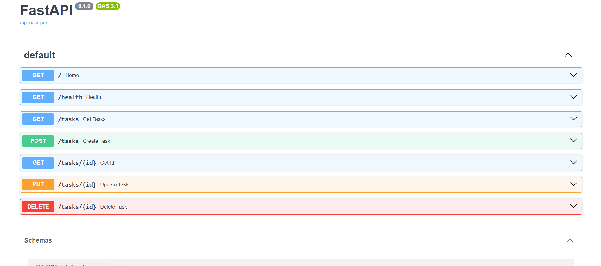

# Task Management REST API

The **Task Management REST API** is a lightweight API that manages a to-do list that is tasked to **create, read, update, and delete tasks**. This API was created using Python 3.13.14 and FastAPI. I created this for my 1st backend engineering assignment on my FlyRank internship program. This assignment has taught me the basic ins and outs of creating a successful backend program.

### Key Features

* **Full CRUD Operations:** Perform complete Create, Read, Update, and Delete actions on task resources.
* **Input Validation & Guardrails:** Utilizes Pydantic schemas and custom validation logic to reject empty JSON payloads and whitespace-only task titles with `400 Bad Request` responses.
* **Standardized REST Responses:** Strictly adheres to HTTP status code conventions, including `201 Created` for task creation, `204 No Content` for successful deletions, and `404 Not Found` for missing items.
* **Automatic OpenAPI Documentation:** Interactive Swagger UI documentation generated out of the box by FastAPI at `/docs`.
* **In-Memory Data Persistence:** Fast, lightweight task management using native Python data structures.

## 2. Installation & Quick Start

### Prerequisites
* **Python 3.10 or higher**

### Setup

1. **Clone the repository:**
   ```bash
   git clone <your-repository-url>
   cd <your-repository-folder>
## Create and activate a virtual environment:
```bash
python -m venv venv
```
# On macOS/Linux:
```bash
source venv/bin/activate
```
# On Windows:
```bash
venv\Scripts\activate
```
## Install dependencies:
```bash
pip install fastapi uvicorn
```

## Start the live local development server with a single command:
```bash
uvicorn main:app --reload
```

The API will be available at `http://127.0.0.1:8000`.

## API Endpoints
| Method | Endpoint | Description | Expected Status Codes |
| :--- | :--- | :--- | :--- |
| `GET` | `/` | Root endpoint returning API metadata | `200 OK` |
| `GET` | `/health` | Server health check | `200 OK` |
| `GET` | `/tasks` | Retrieve all tasks | `200 OK` |
| `GET` | `/tasks/{id}` | Retrieve a single task by ID | `200 OK`, `404 Not Found` |
| `POST` | `/tasks` | Create a new task | `201 Created`, `400 Bad Request` |
| `PUT` | `/tasks/{id}` | Update task title and/or completed status | `200 OK`, `400 Bad Request`, `404 Not Found` |
| `DELETE` | `/tasks/{id}` | Remove a task by ID | `204 No Content`, `404 Not Found` |

## Sample Output (curl -i)

```bash
$ curl -i -X POST [http://127.0.0.1:8000/tasks](http://127.0.0.1:8000/tasks) \
  -H "Content-Type: application/json" \
  -d '{"title": "Study for exam"}'

HTTP/1.1 201 Created
date: Thu, 13 Aug 2026 22:50:00 GMT
server: uvicorn
content-length: 48
content-type: application/json

{"id":4,"title":"Study for exam","done":false}
```

## Below is a sample HTTP request and response when deleting a task (204 No Content):

```bash
$ curl -i -X DELETE [http://127.0.0.1:8000/tasks/1](http://127.0.0.1:8000/tasks/1)

HTTP/1.1 204 No Content
date: Thu, 13 Aug 2026 22:51:00 GMT
server: uvicorn
```
## The Mortality Experiment
What I observed when I restarted the server/API, is that there is no way for the newly created or modified tasks to be saved anywhere in the program. This problem greatly emphasizes the necessity of a database.
## Interactive FastAPI Documentation

With the server running, navigate to `http://127.0.0.1:8000/docs` in your browser to test endpoints using FastAPI's built-in interactive documentation.

